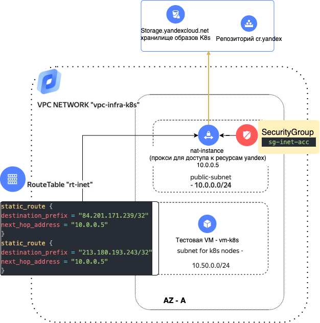

# Cценарий по настройке nat-instance для доступа к cr.yandex/storage.yandexcloud.net


## Установка YC-CLI
Для устанвки YC CLI можно использовать следующий гайд [YC CLI](https://cloud.yandex.ru/docs/cli/quickstart)


## Авторизация терраформ-провайдера через YC
```bash
export YC_TOKEN=$(yc iam create-token)
export YC_CLOUD_ID=$(yc config get cloud-id)
export YC_FOLDER_ID=$(yc config get folder-id)
```

## Схема решения

Плейбук разворачивает следующую инфраструктуру:



<br/>

## Описание компонентов
- **vpc.tf** - разворачивает сеть, две подсети и рисует маршрут для внутренней подсети через nat-instance до указанных ресурсов
- **SG.tf** - разворачивает группу безопасности для nat-instance которая разрешает доступ до указанных ресурсов для членов другой группы (k8s-sg) которая в данном сценарии эмулирует группу на кластере k8s
- **VM.tf** - разворачивает nat-instance и тестовую VM (которая в данном сценарии играет роль k8s кластера)
- **cloud_config_def.yaml** - cloud-init шаблон для создаваемых ресурсов - сюда нужно положить свой публичный ssh-ключ в стандартном формате [Формат метадаты](https://cloud.yandex.ru/docs/compute/concepts/vm-metadata#keys-processed-in-public-images)


## Развертывание плейбука
#### Вызов терраформа
```bash
terraform init
terraform plan
terraform apply
```

## Валидация плебука
Подключаемся к машине vm-k8s и проверяем что есть доступ до cr.yandex и storage.yandexcloud.net но нет доступа до других ресурсов
```bash
ya-user@vm-k8s:~$ nc -v storage.yandexcloud.net 443
Connection to storage.yandexcloud.net 443 port [tcp/https] succeeded!
^C
ya-user@vm-k8s:~$ nc -v cr.yandex 443
Connection to cr.yandex 443 port [tcp/https] succeeded!
^C
ya-user@vm-k8s:~$ nc -v yandex.ru 443
```
## Удаляем инфраструктуру
```bash
terraform destroy
```